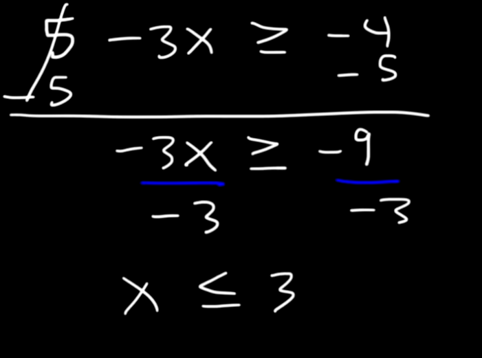

= Algrebra | Linear Inequalities
:docinfo: shared
:source-highlighter: pygments
:pygments-style: monokai
:icons: font
:stem:
:toc: left
:docinfodir: ..

== Multiplying or dividing by negative numbers

When you multiply or divide by a negative number when solving for linear
inequalities make sure to change the direction of the inequality sign.
