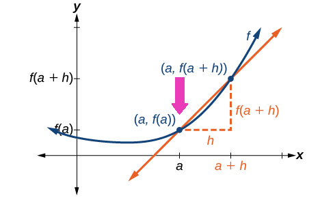
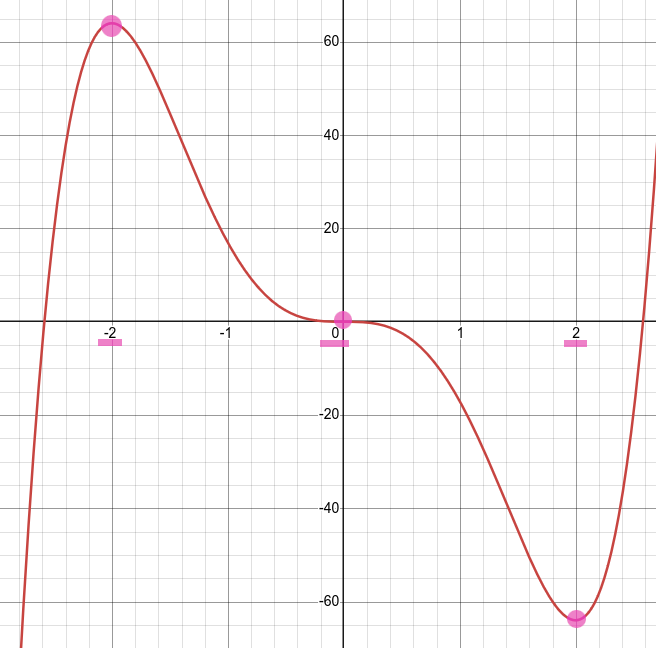

= Calculus | Derivatives
:docinfo: shared
:source-highlighter: pygments
:pygments-style: monokai
:icons: font
:stem:
:toc: left
:docinfodir: ..

== Fromula
[stem]
++++
\lim_{h \to 0} \frac{f(a+h) - f(a)}{h} = f'(a)
++++

[.center]

== Basic Rules

=== Constant Rule
[stem]
++++
\frac{d}{dx} [c] = 0
++++

=== Power Rule
[stem]
++++
\frac{d}{dx} [x^n] = nx^(n-1)
++++

=== Product Rule
[stem]
++++
\frac{d}{dx} [f(x)g(x)] = f'(x)g(x) + f(x)g'(x)
++++

=== Quotient Rule
[stem]
++++
\frac{d}{dx} [\frac{f(x)}{g(x)}] = \frac{f'(x)g(x) - f(x)g'(x)}{(g(x))^2}
++++

=== Chain Rule
[stem]
++++
\frac{d}{dx} [f(g(x))]  = f'(g(x)) * g'(x)
++++

== Finding Critical numbers

Find the critical numbers of
[stem]
++++
f(x) = 3x^5 - 20x^3
++++

1. Find the first derivative of f using the power rule.

[stem]
++++
f(x) = 3x^5 - 20x^3
\
f'(x) = 15x^4 - 60x^2
++++

[start=2]
2. Set the derivative equal to zero and solve for x.

[stem]
++++
15x^4 - 60x^2 = 0
\
15x^2(x^2 - 4) = 0
\
15x^2(x+2)(x-2) = 0
\
15x^2 = 0\ \ or\ \ x + 2 = 0\ \ or\ \ x - 2 = 0
\
x = 0\ \ or\ \ x = -2\ \ or\ \ x = 2
++++

These three X-Values are crtical number of f.

[.center]

== Links
- https://www.derivative-calculator.net/[Derivative Calculator]
