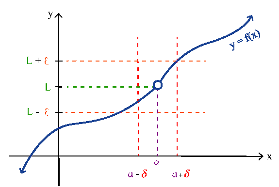
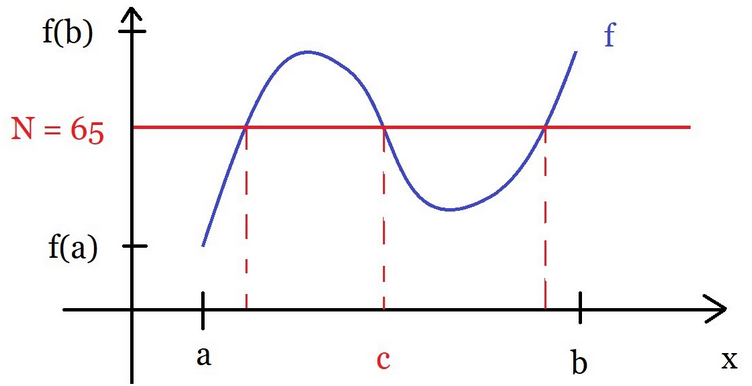

= Calculus | Limits
:docinfo: shared
:source-highlighter: pygments
:pygments-style: monokai
:icons: font
:stem:
:toc: left
:docinfodir: ..

== Delta, Epsilon Definition of a Limit
[stem]
++++
\forall\epsilon\gt0\ \ \exists\delta\gt\0\ \ s.t. \forall\epsilon\mathbb{R}
\ with\ 0 \lt\ |x - a|\ \lt \ \delta,\ we\ have\ |f(x) - L|\ \lt\ \epsilon
++++

[.center]

== Intermediate Value Theorem
Suppose stem:[f] is continuous on stem:[[a,b]], and stem:[N], a number b/t
stem:[f(a)] and stem:[f(b)], where stem:[f(a)\ \ne\ f(b)], then there exists a
number stem:[c] in stem:[(a,b)] s.t stem:[f(c) = N].

[.center]

== Solving for Vertical Asymptotes
[stem]
++++
f(x) = frac{x+4}{(x+4)(x-8)}
++++

* `-4` is removable
* `8` is non-removable

In this function there would be a hole at `-4`

== Limits to Memorize
- stem:[\lim_{x \to 0^+}1/x = \infty]
- stem:[\lim_{x \to 0^-}1/x = -\infty]
- stem:[\lim_{x \to \infty}1/x = 0]
- stem:[\lim_{x \to 0}\sinx/x = \lim_{x \to 0}x/\sinx = 1]
- stem:[\lim_{x \to 0}\frac{cosx - 1}{x} = 0]
- stem:[\lim_{x \to \infty}(1 + 1/x)^x = ]
