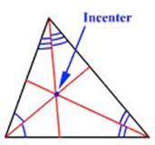

= Geometry | Centers
:docinfo: shared
:source-highlighter: pygments
:pygments-style: monokai
:icons: font
:stem:
:toc: left
:docinfodir: ..

== Incenter

[.center]

== Centroid
== Orthocenter
== Circumcenter
