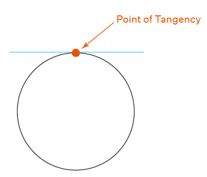
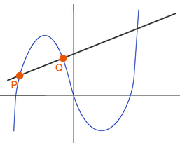

= Algrebra | Circle Theorems
:docinfo: shared
:source-highlighter: pygments
:pygments-style: monokai
:icons: font
:stem:
:toc: left
:docinfodir: ..

== Definitions

Chord::
    Line segment that connects two endpoints on a circle. If a chord passes
    through the center of a circle its known as a diameter

Tangent Line::
    Touches just one point at a curce.

[.center]

Secant Line::
    A line the passes through two points of a curve.

[.center]

== Central Angle
[stem]
++++
\angle ACB = 50^\circ
\
mACB = 50^\circ
++++

[.center]
image::Central-Angle.png[]

== Inscribed Angle
Half the measure of the arc

[.center]
image::Inscribed-Angle.png[]

== Tangent-Chord Angle
