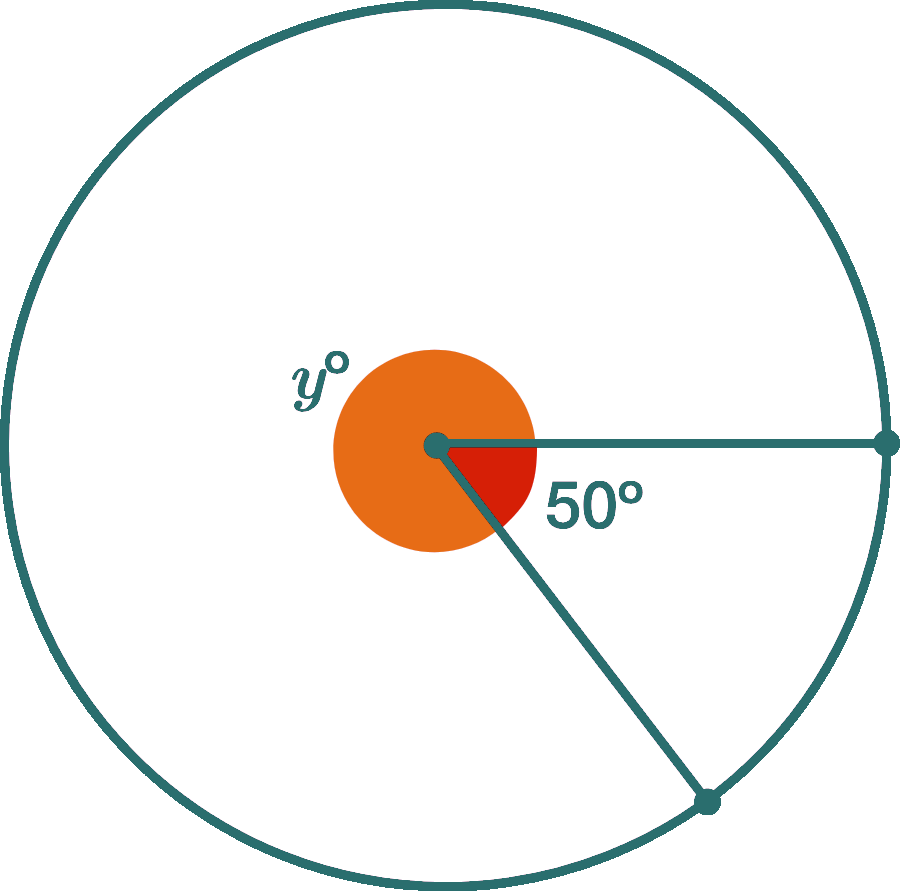
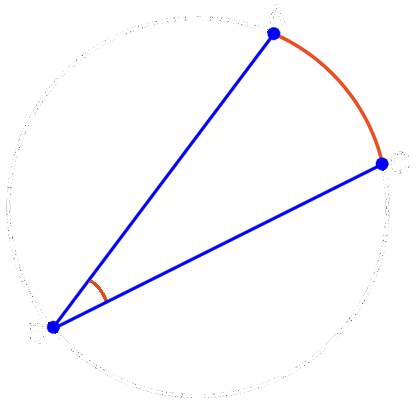
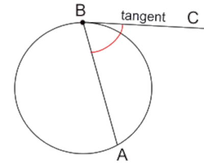
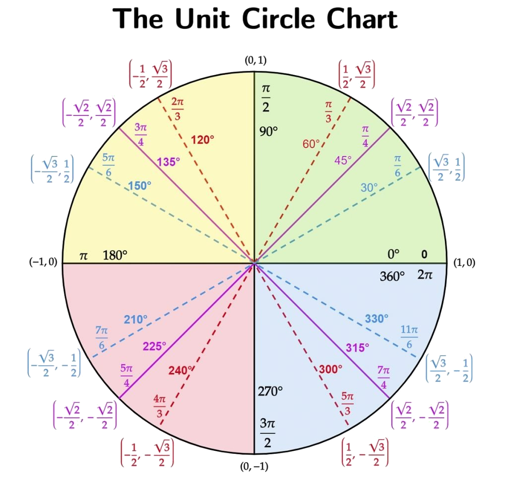

= Algrebra | Circle Theorems
:docinfo: shared
:source-highlighter: pygments
:pygments-style: monokai
:icons: font
:stem:
:toc: left
:docinfodir: ..

== Lines

[.center]
image::https://upload.wikimedia.org/wikipedia/commons/thumb/b/b2/CIRCLE_LINES-en.svg/1024px-CIRCLE_LINES-en.svg.png[]

Chords::
    Line segment that connects two endpoints on a circle. If a chord passes
    through the center of a circle its known as a diameter

Tangent Line::
    Touches just one point at a curce.

Secant Line::
    A line the passes through two points of a curve.

Radius::
    half of diameter

== Central Angle
[stem]
++++
m\angle ACB = mACB
++++
// [stem]
// ++++
// \angle ACB = 50^\circ
// \
// mACB = 50^\circ
// ++++

[.center]

== Inscribed Angle
[stem]
++++
m\angle ABC = \frac{1}{2}m \overarc{AC}
++++

[.center]

== Tangent-Chord Angle
[stem]
++++
m\angle ABC = \frac{1}{2}(m\overarc{AB})
++++

[.center]

== Unit Circle
y:: sine
x:: cosine

== Standard Circle Formula

[stem]
++++
(x -h)^2 + (y - k)^2 =r^2
++++

`h` and `k` are the x and y coordinates of the center of the circle.

== Drawing a Circle in C

Without Standard Circle Formula:
[source, c]
----
void drawCircle(SDL_Renderer *ren, float radius, SDL_Point center, uint32_t color)
{
    
    float x = 0;
    float y = 0;
    for(float i = 0; i < 2 * M_PI; i += 0.001f)
    {
        x = cos(2.0f * M_PI * i);
        y = sin(2.0f * M_PI * i);
        SDL_Rect point = {
            (x * radius) + center.x, 
            (y * radius) + center.y,
            1, 
            1
        };
        SDL_SetRenderDrawColor(ren, 0, 0, 0, 255);
        SDL_RenderFillRect(ren, &point);
    }
}
----

== Links
- https://www.desmos.com/geometry[Desmos Geometry]
