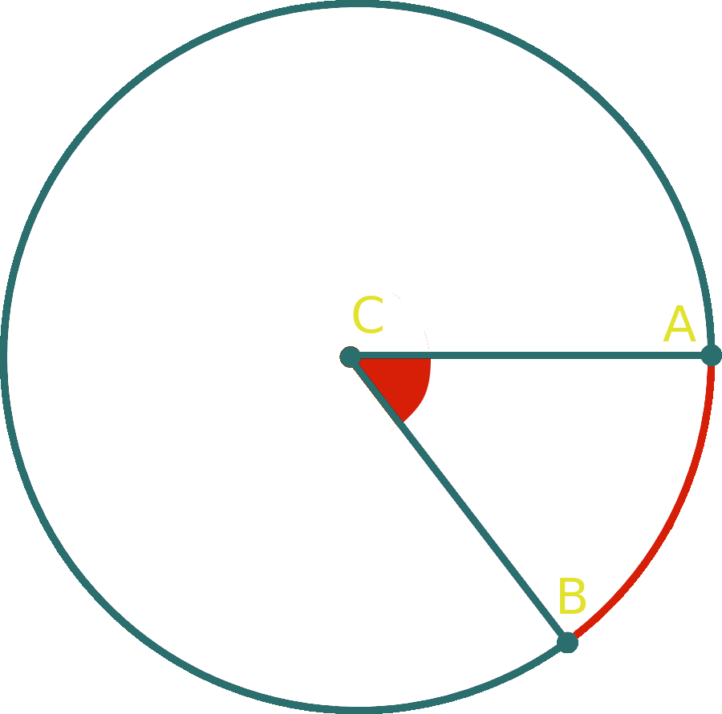

= Algrebra | Circle Theorems
:docinfo: shared
:source-highlighter: pygments
:pygments-style: monokai
:icons: font
:stem:
:toc: left
:docinfodir: ..

== Chord

chord::
    Line segment that connects two endpoints on a circle

If a chord passes through the center of a circle its known as a diameter

== Central Angle
[stem]
++++
\angle ACB = 50^\circ
\
mACB = 50^\circ
++++

[.center]

== Inscribed Angle
Half the measure of the arc

[.center]
image::Inscribed-Angle.png[]

