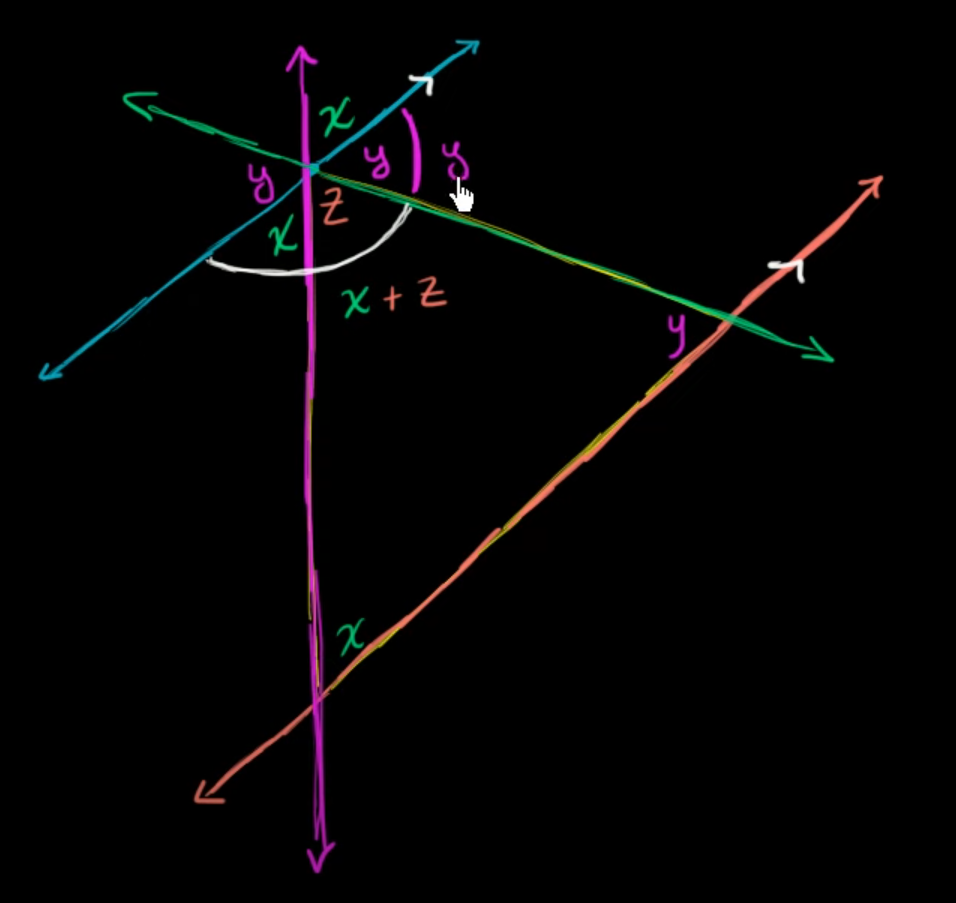

= Geometry | Triangles
:docinfo: shared
:source-highlighter: pygments
:pygments-style: monokai
:icons: font
:stem:
:toc: left
:docinfodir: ..

== Angles
All of the angles of a triangle equal 180 degrees. This image is a simple proof
of that.

