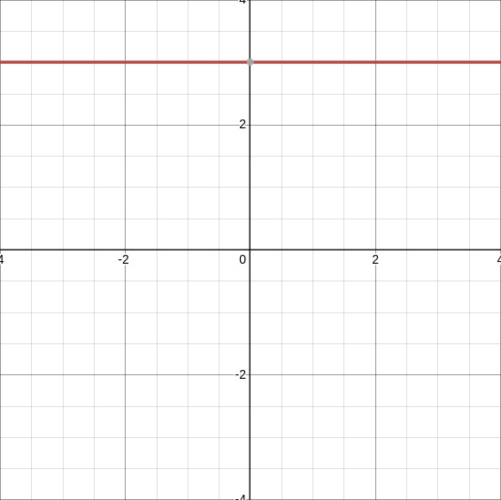
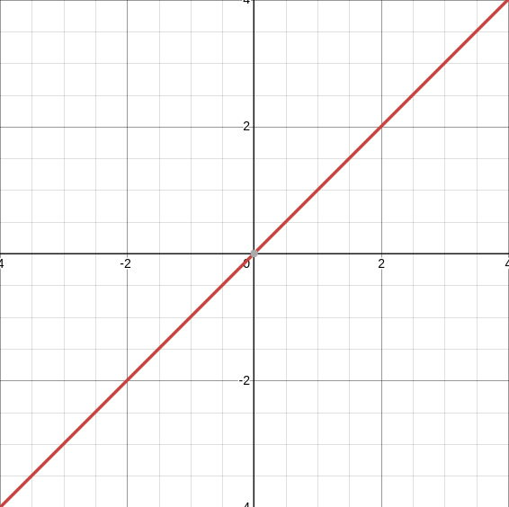
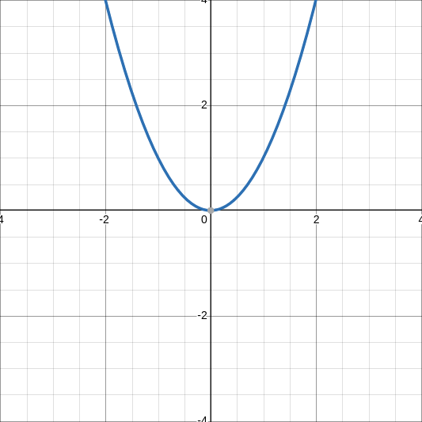
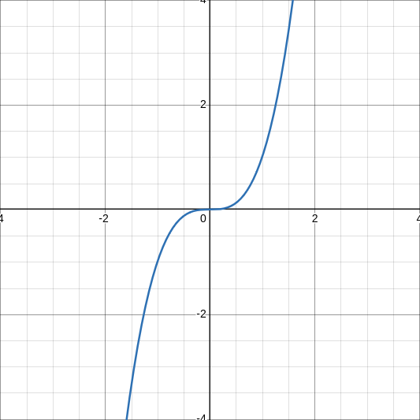
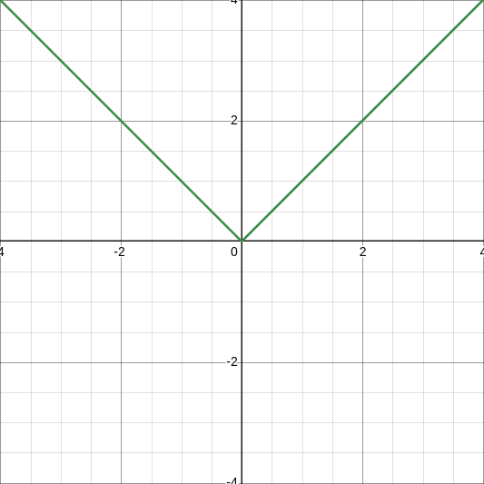
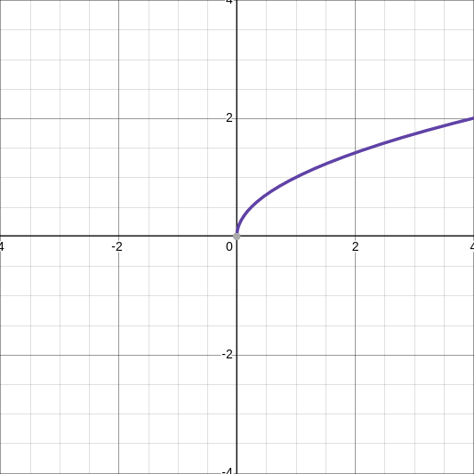
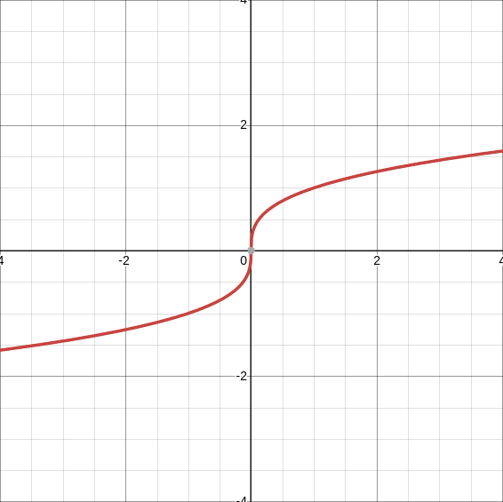
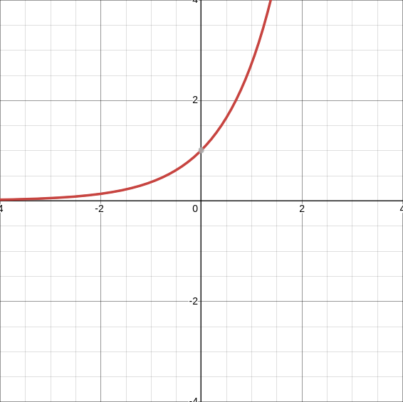
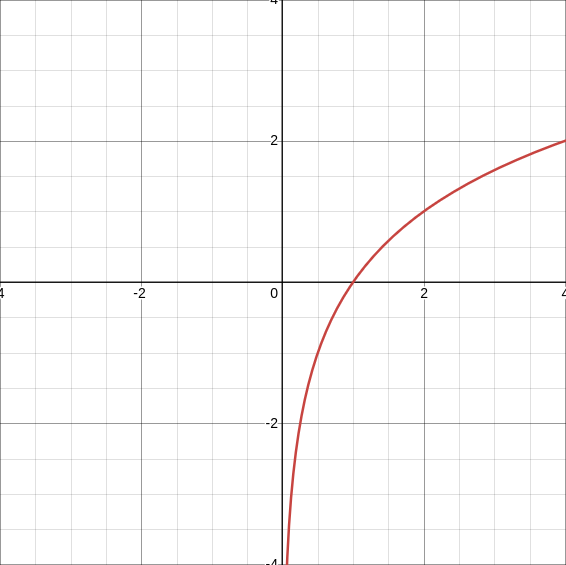
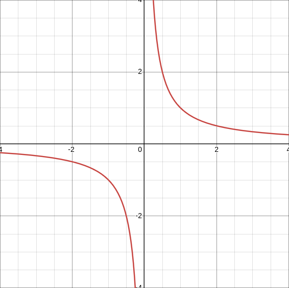

= Parent Functions
:docinfo: shared
:source-highlighter: pygments
:pygments-style: monokai
:icons: font
:stem: latexmath
:toc: left
:docinfodir: ..

== Constant Functions
[.example]
[stem]
++++
y = c
++++

Domain:: stem:[(-\infty,\infty)]
Range:: stem:[C] (constant)

[.center]

== Linear Functions
[.example]
[stem]
++++
y = x
++++

Domain:: stem:[(-\infty,\infty)]
Range:: stem:[(-\infty,\infty)]

[.center]

== Quadradic Functions
[.example]
[stem]
++++
y = x^2
++++

Domain:: stem:[(-\infty,\infty)]
Range:: stem:[[0,\infty)]

[.center]

== Cubic Functions
[.example]
[stem]
++++
y = x^3
++++

Domain:: stem:[(-\infty,\infty)]
Range:: stem:[(-\infty,\infty)]

[.center]

== Absolute Value Functions
[.example]
[stem]
++++
y = |x|
++++

Domain:: stem:[(-\infty,\infty)]
Range:: stem:[[0,\infty)]

[.center]

== Radical Functions
=== Square Root
[.example]
[stem]
++++
y = \sqrt{x}
++++

Domain:: stem:[(0,\infty)]
Range:: stem:[[0,\infty)]

[.center]

=== Cubed Root
[.example]
[stem]
++++
y = \sqrt[3]{x}
++++

Domain:: stem:[(-\infty,\infty)]
Range:: stem:[(-\infty),\infty)]

[.center]

== Exponential Functions
[.example]
[stem]
++++
y = b^x
++++

Horizontal Asymbtote::: 0
Domain:: stem:[(\infty,\infty)]
Range:: stem:[(0,\infty)]

[.center]

== Logoritmic Functions
[.example]
[stem]
++++
y = log_{b} x
++++

Vertical Asymbtote:: 0
Domain:: stem:[(0,\infty)]
Range:: stem:[(-\infty,\infty)]

[.center]

== Reciprocal Functions
[.example]
[stem]
++++
y = \frac{1}{x}
++++

Vertical Asymptote:: 0
Domain:: stem:[(-\infty, 0) \cup (0, \infty)]
Range:: stem:[(-\infty, 0) \cup (0, \infty)]

[.center]

