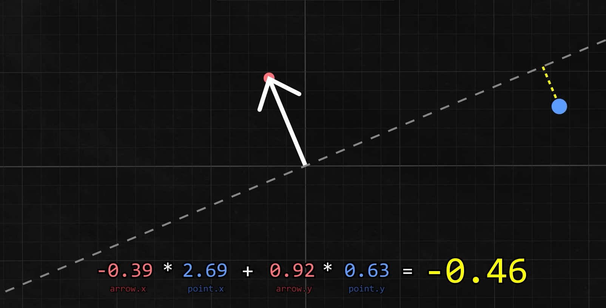

= Linear Algrebra | Basics
:docinfo: shared
:source-highlighter: pygments
:pygments-style: monokai
:icons: font
:stem: latexmath
:toc: left
:docinfodir: ..

== Dot Product

=== inner-product
[stem]
++++
\overrightarrow{a} \cdot \overrightarrow{b} \\
\left[ \begin{array}{c}
a_{1} \\
a_{2} \\
\vdots \\
a_{n}
\end{array} \right]

\cdot

\left[ \begin{array}{c}
b_{1} \\
b_{2} \\
\vdots \\
b_{n}
\end{array} \right]
=
a_{1} * b_{1} + a_{2} * b_{2} + * a_{n} * b_{n}
++++

=== normal vector and dot procuct

A normal vector has a magnitude of one and can point in any direction. The dot
product of the normal vector and a point can tell you the distance that point is
in that direction from the starting point of the normal vector.

[stem]
++++
a = normal vector \\
b = point \\
\\
a.x * b.x + a.y * b.y = distance

++++

== Matrix Multiplication
[stem]
++++
A \otimes B = C
\\
A = 
\left[\begin{array}{a}
a_{11} & a_{12} \\
a_{21} & a_{22} \\
\end{array}\right]

B = 
\left[\begin{array}{b}
b_{11} & b_{12} & b_{13} \\
b_{21} & b_{22} & b_{23} \\
\end{array}\right]
\\
C =
\\
\left[\begin{array}{c}
(a_{11} * b_{11}) + (a_{12} * b_{21}), & (a_{11} * b_{12}) + (a_{12} * b_{22}), & (a_{11} * b_{13}) + (a_{12} * b_{23}) \\
(a_{21} * b_{11}) + (a_{22} * b_{21}), & (a_{21} * b_{12}) + (a_{22} * b_{22}), & (a_{21} * b_{13}) + (a_{22} * b_{23})
\end{array}\right]
++++

=== Demension Rules
[stem]
++++
B = p \times q
\\
A = m \times n
++++

stem:[n] has to be equal to stem:[p]. The demensions of stem:[C] is stem:[m \cdot q]

== Finding the Magnitude of a Vector
[stem]
++++
||\overrightarrow{a}|| = \sqrt{a_{1}^2 + a_{2}^2 + \dots a_{n}^2}
++++

== Identity Matrix
One's are on the diagonal from top left to bottom right. Every other element is
zero
[stem]
++++
\left[\begin{array}{a}
1 & 0 & 0 \\
0 & 1 & 0 \\
0 & 0 & 1 \\
\end{array}\right]
++++

== Inverse Matrix
When a matrix is multiplied by an inverse matrix the result is an identity
matrix

== Angles
=== orthogonality (right angles)
If the dot product of two vectors is equal to zero then the rays must be
perendiculator to each other

=== Fiding the angle between two vectors
[stem]
++++
\frac{u \cdot v}{||u|| \cdot ||v||} = cos(\theta)
++++

The result is the x value of the unit cirle, from that you can determine the y
value of the unit circle and the angle.
