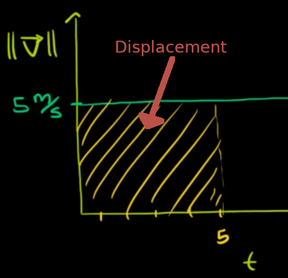
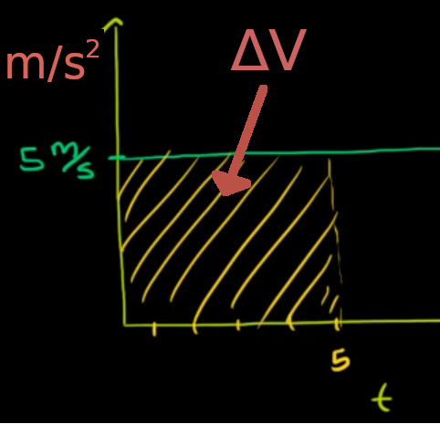

= Physics | Basics
:docinfo: shared
:source-highlighter: pygments
:pygments-style: monokai
:icons: font
:stem:
:toc: left
:docinfodir: ..

== Kinematic's

=== Symbols

[.inline]
* stem:[V] or stem:[V_{f}] -> Final velocity

[.inline]
* stem:[a] or stem:[\vec{a}] -> Acceleration

[.inline]
* stem:[t] -> Time

[.inline]
* stem:[V_{0}] -> Initial Velocity

[.inline]
* stem:[\overline{S}] -> Average Speed

[.inline]
* stem:[X_{F}] -> Final Position

[.inline]
* stem:[\Deltax] -> Distance?

[.inline]
* stem:[\vec{V_{a}}] -> Average Velocity

[.inline]
* stem:[S_{i}] -> Instantaneos Speed

[.inline]
* stem:[V_{i}] -> Instantaneos Velocity

[.inline]
* stem:[X_{0}] -> Initial Position

[.inline]
* stem:[V_{t}] -> Terminal Velocity

[.inline]
* stem:[\vec{S}] -> Displacement

[.inline]
* stem:[\vec{V}] -> Vector

[.inline]
* stem:[S_{a}] -> Speed Average

=== Equations

[.inline]
* stem:[V = V_{0}+at]

[.inline]
* stem:[\Deltax = V_{0}t + 1/2at^2]

[.inline]
* stem:[\Deltax = \frac{V + V_{0}}{2}t]

[.inline]
* stem:[V^2 = V_{0}^2 + 2a\Deltax]

[.inline]
* stem:[\vec{V} = \vec{S}/t] or stem:[r = d/t]

[.inline]
* stem:[\vec{V_{a}} = \frac{\Deltax}{t}]

[.inline]
* stem:[\vec{a} = \frac{\Delta\vec{V}}{t}] or stem:[a = \frac{V_{f} - V_{i}}{\Deltat}]

[.inline]
* If acceleration is constant: stem:[\vec{V_{a}} = \frac{V_{f} + V_{i}}{2}]

[.inline]
* stem:[\vec{S} = (\vec{V_{a}})\Deltat]

[.inline]
* stem:[\vec{S} = \frac{V_{f}^2-V_{i}^2}{2\vec{a}}]

[.inline]
* stem:[2\vec{a}\vec{s} = V_{f}^2 - V_{i}^2]

[.inline]
* stem:[\DeltaV = a\Deltat]

[.inline]
* stem:[\frac{\Deltaa}{\Deltat} = jerk]

[.inline]
* stem:[V_{i} = V_{f} - a\Deltat]

[.inline]
* stem:[\Deltat = \frac{V_{f} - V_{i}}{a}]

[.inline]
* stem:[S_{a} = \frac{\text{distance}}{\Deltat}]

NOTE: If the divisor is t then it is assumed to be stem:[\Deltat]

=== Instentaneos Rate of Change
[stem]
++++
\lim_{\Delta \to 0} \frac{f(x + \Deltax) - f(c)}{\Deltax} = f'(x)\
or \
\lim_{x \to c} \frac{f(x) - f(c)}{x - c} = f'(c)
++++

[stem]
++++
f'(x) = v(t) -> \text{Instentaneos Velocity}\
f''(x) = a(t) -> \text{acceleration}\
|f'(x)| = s(t) -> \text{Instentaneos speed}\
f'''(x) -> jerk
++++

== Force and Gravity
=== Symbols
[.inline]
* stem:[\vec{F}] -> Force of Gravity

[.inline]
* stem:[g] -> Acceleration of Gravity

[.inline]
* stem:[m] -> mass of object

[.inline]
* stem:[r] -> distance between objects

=== Equations
[.inline]
* stem:[\vec{F} = m \cdot g]

[.inline]
* stem:[a = \vec{F}/m]

[.inline]
* stem:[a = g]

[.inline]
* stem:[\vec{F} = G \frac{m_{1}m_{2}}{r^2}]

=== Constants
[.inline]
* g = stem:[9.81 frac{m}{s^2}]

== Temrinal Velocity
[stem]
++++
V_{t} = frac{sqrt{2mg}}{pAC_{d}}
++++

* stem:[V_{t}] represents terminal velocity
* stem:[m] is the mass of the falling object
* stem:[g] is accleration due to gravity
* stem:[C_{d}] is the drag coefficent
* stem:[p] is the density through which th object is falling
* stem:[A] is the projected area of the object

== Graphing
=== Velocity vs. Time Graphs
* Slope is acceleration and a way to find instentaneos velocity
* Area is displacement

[.center]

=== Acceleration vs. Time Graphs
* Slope is jerk
* Area is change in velocity
* Typical y-axis: stem:[m/s^2]

[.center]

== Links
- https://en.wikipedia.org/wiki/Terminal_velocity[Terminal Velocity]
