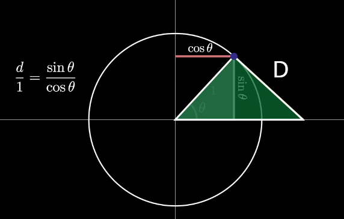

= Triginometry | Basics
:docinfo: shared
:source-highlighter: pygments
:pygments-style: monokai
:icons: font
:stem:
:toc: left
:docinfodir: ..

== SOH CAH TOA

== Using inverse functions To Find Angle
[stem]
++++
\tan\theta = \frac{20.8}{7}
++++

[stem]
++++
\tan^-1\theta = tan^-1(\frac{20.8}{7})
++++

[stem]
++++
\theta = 71.4^\circ
++++

NOTE: Make sure calculator is in degrees to get the answer in degrees

NOTE: The inverse version of sine, cosine, and tangent have the "arc" prefix

== Trig Visualized
https://www.youtube.com/watch?v=dUkCgTOOpQ0[Trig Visualized]

In this video _d_ represents the line that is tangent to the circle. and the
tangent also represents that slope of the radius

this works because we get the tangent with TOA or
stem:[tan(\theta) = \frac{opposite}{adjacent}].
We know that at a 45 degree angle stem:[sin(\theta)] and stem:[cos(\theta)] are
going to be the same value. If they are divided by each other they should equal
the length of the tangent/radius, which is 1. Hence, they have the same ratio.

[source, lua]
----
local radii = {1, 2, 4, 5}

function toRadians(degrees)
    return (degrees * (math.pi/180))
end

for k, v in pairs(radii) do
    print(
        "radius: " .. 
         v ..
         ", " ..
        "tangent: " .. 
        math.tan(toRadians(45)) 
    )
end

----

.output
[%collapsible]
====
radius: 2, tangent: 1
radius: 4, tangent: 1
radius: 5, tangent: 1

====

notice how the tangent is always one when you're at a 45 degree angle. No matter
what the radius. 

== Links
* https://www.youtube.com/watch?v=jt7p-mCC0ng[Evaluating Inverse Functions]
* https://www.youtube.com/watch?v=dUkCgTOOpQ0[trig visualization]
