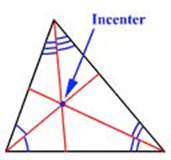
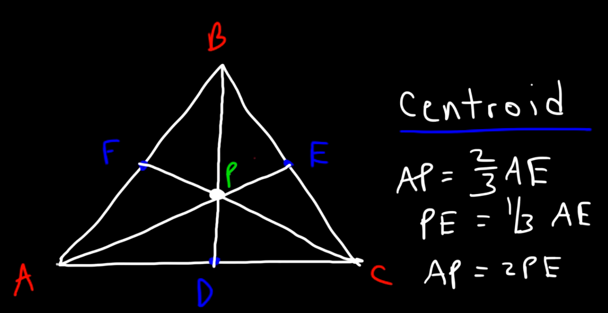

= Geometry | Centers
:docinfo: shared
:source-highlighter: pygments
:pygments-style: monokai
:icons: font
:stem:
:toc: left
:docinfodir: ..

== Incenter

[.center]

Incenter should be the center of the inscribed circle

== Centroid
[.center]

== Orthocenter
== Circumcenter
